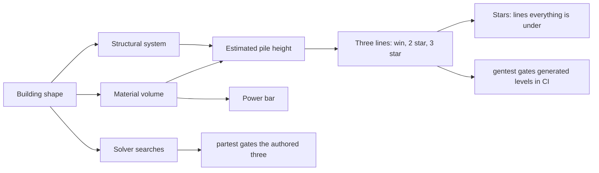
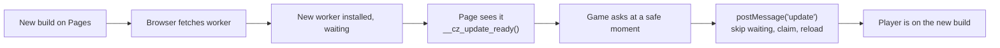
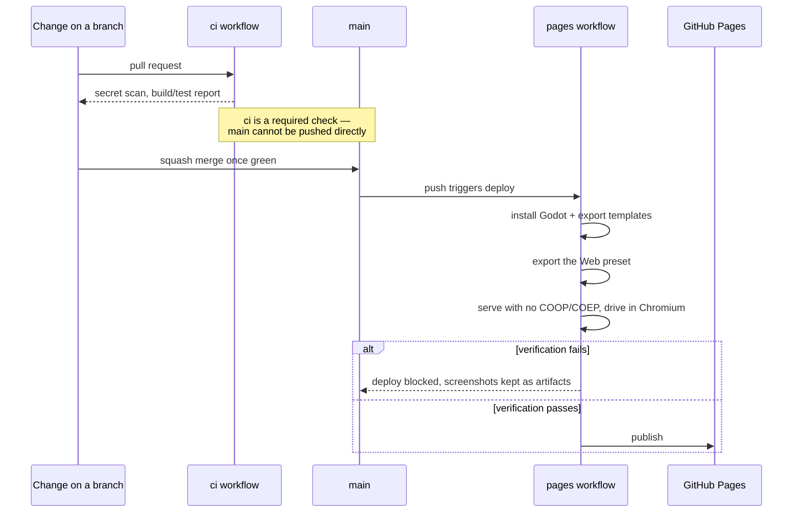
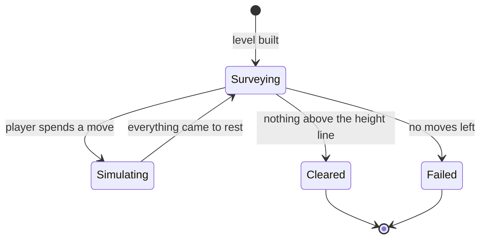

# Architecture

High-level map of CrumplZone: what the pieces are, how they fit, and which
of them ship. For what the game is meant to be, see `CHARTER.md`.

The game is early: one hand-built level, three tools, no generation and no
scoring. This describes what is here, and is updated in the same change that
adds, removes or rewires a component.

## Components

```mermaid
graph TD
    subgraph ships["Ships to players"]
        main["main.gd<br/>input, tool choice, readout"]
        ui["ui.gd<br/>CSS pixels → viewport units"]
        intro["intro.gd<br/>guide, version, release notes"]
        results["results.gd<br/>end of level, stars"]
        icons["icons.gd<br/>drawn tool icons"]
        notes["release_notes.gd<br/>player-facing changes"]
        effects["effects.gd<br/>what the tool just did"]
        backdrop["backdrop.gd<br/>sky, skyline, street"]
        level["level.gd<br/>structure, physics, the rule"]
        materials["materials.gd<br/>durability and colour"]
        fracture["fracture.gd<br/>how a shape comes apart"]
        tools["tools.gd<br/>the three verbs"]
        levels["levels.gd<br/>hand-built specs<br/>lines, pile, power"]
        architecture["architecture.gd<br/>real structural systems"]
        generator["generator.gd<br/>seeded specs"]
        solver["solver.gd<br/>searches for a solution"]
    end

    subgraph checks["Checked, not shipped"]
        partest["partest.gd<br/>solvability and depth<br/>for all three difficulties"]
        waketest["waketest.gd<br/>settled bodies get woken"]
        breaktest["breaktest.gd<br/>everything breakable breaks"]
        stresstest["stresstest.gd<br/>weight breaks the right things"]
        collapsetest["collapsetest.gd<br/>broken columns stop carrying"]
        gentest["gentest.gd<br/>generated levels stand up<br/>and stay winnable"]
        shots["shots.gd<br/>a picture of each system<br/>looked at, not asserted"]
        verifylv["verify_levels.gd<br/>generate-and-verify measurement"]
    end

    subgraph build["Build and deploy"]
        pages["pages.yml<br/>export → verify → deploy"]
        verify["tools/verify-web-export<br/>runs the build in a browser"]
        ci["ci.yml<br/>secrets, GDScript, harnesses<br/>required on main"]
    end

    subgraph knowledge["Measured, not shipped"]
        spike["spikes/determinism/<br/>physics repeatability harness"]
    end

    subgraph docs["Intent"]
        charter["CHARTER.md<br/>design decisions"]
        arch["ARCHITECTURE.md"]
    end

    main --> intro
    notes --> intro
    ui --> main
    ui --> intro
    ui --> results
    icons --> main
    main --> results
    main --> effects
    main --> backdrop
    main --> level
    main --> tools
    materials -->|what a block is made of| level
    materials -->|swatches and hit counts| intro
    levels -->|level spec| level
    tools -->|acts on| level
    architecture -->|blocks for one system| generator
    generator -->|level spec| solver
    levels -->|lines, pile, power| generator
    solver -->|drives headlessly| level
    partest -->|drives headlessly| level
    verifylv -->|drives| solver
    partest -->|gates| ci
    waketest -->|drives| level
    waketest -->|gates| ci
    breaktest -->|drives| level
    breaktest -->|gates| ci
    stresstest -->|drives| level
    stresstest -->|gates| ci
    collapsetest -->|drives| level
    collapsetest -->|gates| ci
    fracture -->|cuts a piece in two| level
    gentest -->|drives| generator
    shots -->|renders| generator
    gentest -->|gates| ci
    verifylv -->|gates| ci
    main -->|exported as WASM| pages
    pages --> verify
    verify -->|blocks deploy on failure| pages
    spike -.->|constrains the design of| charter
    charter -.->|governs| main
```

**`game/`** is the only component that reaches players. It is a Godot 4
project targeting the GL Compatibility renderer, split along one seam that
matters:

- **`level.gd`** owns a structure, the physics, and the height-line rule. It
  has no input handling, no UI and no scoring, because the charter's levels
  must be verified solvable before anyone plays them — which means a solver
  has to run this exact code thousands of times with nobody watching.
- **`materials.gd`** says what a block is made of and how much damage it
  absorbs before it comes apart, how many pieces it makes when it does, and what
  colour it is at each stage of wear. Durability runs 1 to 100 and one
  jackhammer blow is 12 of it, so the scale reads directly as blows: glass 1,
  brick 1, concrete 2, steel 3, reinforced concrete 9 — more than any budget.
  It is the reason a structure can be read before it is touched: glass is
  obviously the weak part and the core is obviously not worth your moves,
  without a legend.
- **`fracture.gd`** is pure geometry: it cuts a convex polygon with a straight
  line and keeps both halves convex, so a fragment can carry a real collider
  rather than an approximation of one. It has two patterns, because two
  materials break in genuinely different ways — brittle material comes apart in
  slivers radiating from the point struck, and structural material parts on one
  or two sloped faces. That slope is a physics decision, not a cosmetic one: a
  face only slides when its angle exceeds `atan(friction)`, so a shallow break
  locks together and a broken column carries its load as if it were whole.
  `collapsetest.gd` is what holds that honest.
- **`tools.gd`** holds the three verbs. Each is a different way of acting on a
  structure rather than a damage number: the jackhammer shatters the one piece
  you point at, the explosive pushes radially and damages by distance, and the
  wrecking ball is not a tool function at all — it asks `level.gd` for a real
  42 kg body on a pinned chain, released from the top of its arc, and the
  engine decides the rest. Its damage comes out of the momentum it is carrying
  when it lands rather than from a constant. All cost one move,
  and none of them delete anything — a block that vanished never read as
  physics. What they cost in damage meets what a material absorbs, which is
  where durability turns into a decision.
- **`architecture.gd`** holds the structural systems, one function each, taken
  from how buildings are really put together: a glazed steel frame, a
  large-panel block, a flat-slab frame, a stacked chimney, a portal-framed
  shed, and load-bearing masonry. They are here rather than in the generator
  because the difference between them is the game — each stands up for a
  different reason, so each has a different load path to attack, and a tool
  that works on one is the wrong tool for another. A system is only listed in
  `GENERATED` once it stands still on its own, and each one earned its place
  there by a structural change rather than a tuned constant: footings under
  the shed, a reinforced ground storey in the panel block, a plinth under the
  stack, and columns that get bigger lower down in the masonry wall and the
  flat-slab frame, because there is more above them.
- **`levels.gd`** produces hand-built level specs — plain dictionaries of
  blocks — and, in `finish()`, attaches everything that follows from the shape
  of a building: how much rubble it will leave, where the three lines go, and
  how much power bar it gets. Authored and generated levels both come through
  it, so they are rated the same way. **`generator.gd`** picks a system, an era
  and a setting from a seed; the era substitutes materials without touching the
  load path, and the setting decides which city stands behind it.
  Neither decides whether a level is any good.
- **`solver.gd`** does. It searches a level's move space by playing it: build,
  apply a candidate move, simulate to rest, score what is left, beam-search
  outward. A level is only playable once the solver has found a solution, and
  the move budget is that solution's length plus slack. It is tick-driven
  rather than a blocking loop, because physics only advances on physics frames
  and because generation will eventually need to run without freezing the game.
- **`main.gd`** is the player-facing wrapper: input, tool selection, the
  readout, and on-screen buttons for touch. It also frames the camera on the
  level, so the building fills whatever shape of screen it is given rather than
  sitting in a letterbox.
- **`ui.gd`** converts CSS pixels — the unit the mobile-first rules in
  `AGENTS.md` are written in — into the viewport units Godot lays out in. Every
  screen is built in CSS pixels and its layer scaled by that factor, which is
  what makes a 44 px touch target 44 px on a phone as well as on a laptop.
- **`results.gd`** ends a level: cleared or out of power, what is still
  standing, and a rating out of three drawn from how much of the bar was left.
  **`icons.gd`** draws the tool icons — vector art rather than font glyphs,
  because the two symbols this project did try to type both rendered as tofu
  boxes on the builds that shipped them.
- **`effects.gd`** draws what a tool just did, and **`backdrop.gd`** draws the
  sky, the skyline and the street. Both are strictly cosmetic: they own no
  bodies and apply no forces, because the solver replays this game thousands of
  times headlessly and an animation that touched the simulation would make
  every one of those verdicts a lie about the game the player gets.
- **`intro.gd`** is the screen a player meets first — the goal, the three
  tools, the controls, the version and what changed in it. **`release_notes.gd`**
  holds the player-facing notes. The version itself lives in `project.godot` as
  `config/version`, and CI fails if it disagrees with the newest heading in
  `CHANGELOG.md`, so the game cannot tell a player one version while the
  repository says another.

Scoring and generated levels are still absent.

**`spikes/`** holds measurement harnesses that answer a question and then stay
as evidence. They are not imported by the game and are not exported. The one
here established that Godot's 2D physics repeats reliably enough for the
charter's generate-and-verify design.

**`tools/`** holds checks that are too slow or too browser-shaped to live in
the main test gate but must still be reproducible rather than done by hand.
`verify-web-export` proves the build runs where Pages serves it;
`verify-pwa` proves a browser will offer to install it *and* that the game puts
the offer on screen. The second half of that matters more than it sounds: the
offer can break in the manifest, in the page's hooks, or in the game noticing,
and it had broken in the third place while the first two were perfect.
`verify-update` proves a change reaches someone who already has the game: it
loads a build, publishes a newer one over the top of it, and checks the page
ends up running the new one without clearing anything or closing the tab. A
fresh browser always sees the newest build, so no manual test can answer this.

### Difficulty, the lines, and the rating

A level is a shape; everything numeric about it is measured from that shape,
never chosen by hand:

- **The pile** is how high the rubble would sit if the building were pulverised
  completely — estimated from its material volume and how far that system's
  debris spreads, with a safety factor, since nothing is ever deleted.
- **Three lines** follow from the pile. The third-star line sits just above it,
  so three stars means taking a building to very near the flattest it can
  physically be left. The winning line sits well clear, so bringing a building
  down is never the hard part. The second sits midway. All three are capped
  under a share of the building's own height, and then the pile wins, or a wide
  low building would be won before it was touched.
- **The power bar** is a multiple of the building's material area, sized to be
  enough rather than to be exact.
- **The rating** is how many lines everything is under when the dust settles.

This replaced rating against par — what the solver's best solution costs. Par
was correct and unmaintainable: it had to be re-measured with the solver
every time the physics changed what a demolition costs, which happened twice
in one day. Lines derived from the pile hold their meaning through a physics
change, are drawn on the level so the player can see what they are aiming at,
and work on a generated level nobody has ever solved.

Getting under the first line ends the level only if you want it to. The result
screen offers the choice: bank it, or go back with the power still in the bar
and try for the next line.

`shots.gd` is the other half of that, and not a gate: it renders one picture
of each system through a real renderer, which the harnesses deliberately do
without. A number can say a wall sagged 15 px; only the picture said the wall
was leaning, which is a different fault with a different cause. Look at the
pictures when a building misbehaves in a way its measurements do not explain.

`gentest.gd` gates the generated side: it samples a dozen seeds and fails if
any building damages itself or sags while standing untouched, or if the pile
estimate comes in under what the level really leaves — which would put the
third line under reachable and make three stars impossible. `partest.gd` still
runs the solver over the three authored difficulties, and `oneshottest.gd`
fails if any single use of any tool clears the hard level on its own.

### Staying current

An exported build is served cache-first by a service worker, which is what
lets an installed app run offline and is also how an app gets stuck on the
build it was installed with. Three pieces keep that from happening, and each
was added because the piece before it turned out not to be enough:

- The page **registers the worker**. Godot only does so when the browser is
  missing a feature the build needs — with threads off nothing is, so no
  worker was registered at all and the installable app had no offline support.
- The page **watches for a newer worker** and publishes `__cz_update_ready()`.
- The game **applies it at a safe moment** — the help screen, or the start of
  a level — because switching builds reloads the page, and doing that mid-level
  would throw the level away.

## How a change reaches players

The verification step is the load-bearing part. A Godot web build with threads
enabled requires cross-origin isolation headers that GitHub Pages cannot send;
threads are therefore off in `game/export_presets.cfg`. That setting is easy to
flip back by accident, and the failure would appear in a player's browser
rather than in CI — so the pipeline serves the real artifact from a plain
static server, loads it in a real browser, and refuses to deploy unless it
renders and responds to input.

## The game's own structure

Weight is part of the demolition, not just the tools. Every piece reports what
its contacts are pushing through it, and anything over the material's tolerance
accumulates as damage — so a pane under a floor slab cracks and fails, and a
piece struck hard enough fails on the blow. The tolerances are measured against
a real building rather than chosen (see `materials.gd`), and `stresstest.gd`
stands an untouched tower up for six seconds and fails if a single piece so
much as takes damage, because a table tuned slightly too low would quietly turn
every level into one that collapses before it is played.

Rubble that comes to rest below the line is retired: its collider goes, it
stops being counted, and it stays where it fell as part of the street. So does
anything thrown clean out of the world — which is a correctness fix rather than
a tidy-up, because a level with one piece still accelerating never reports
itself settled, and a level that never settles never ends.

Play is paced by a power bar rather than by a count of moves: every use of a
tool takes a bite out of it, sized by how long the tool was held. Holding is
the whole interface — the jackhammer repeats while held, and the ball and the
charge build up and go on release — so the player decides how much to spend on
each use rather than every use costing the same.

The solver still works in whole, full-strength uses, which is the most
expensive way to play. That keeps its search discrete and, more usefully, means
a solution it finds is affordable however the player chooses to spend: tapping
or chipping buys *more* uses out of the same bar, never fewer. The wrecking ball is part of that: it is a
real body on a pinned chain rather than a force applied to an area, so a move
that swings it is not finished until the ball has swung, landed, been lifted
clear, and the building has stopped moving. `level.gd` reports the world
unsettled for as long as the ball is in play, which is what stops a move being
judged before its tool has arrived. `level.gd` watches body velocities to
decide when the world has settled, then counts pieces whose *outline* — not
centre — still reaches above the line.

Where that line sits is computed from the level's own material volume, by
`Levels.line_above_ground` — not chosen, and not a constant. Nothing is ever deleted, so a
demolished building has to fit underneath it as rubble: pulverise the hand-built
level completely and it settles into a pile 119 px deep, which is why the line
sits at 135 and not at the 100 it started at. A level whose line is below its
own rubble is unsolvable for reasons no amount of tactics can fix, and the
symptom — a beam search that plateaus at every depth — looks exactly like a
level that is merely hard.

A tool that finds nothing to act on costs no move. Spending a move on a
misclick would punish imprecision, which the charter's second pillar says not
to do.

## Things that are deliberately absent

- **No unit test framework.** The charter's testing default says to propose a
  setup rather than impose one, and so far the checks that earn their keep are
  behavioural rather than unit-shaped: the secret scan, the web export
  verification, `partest.gd`, which searches the move space to confirm the
  level is solvable within its budget and not solvable in one move, and
  `waketest.gd`, which guards the sleeping-body fix. All of them run in CI. A unit framework becomes worth proposing when the generator
  arrives and there are pure functions worth pinning.
- **Generated levels are not wired into the game yet.** The generator and
  solver work and are measured, but verifying one level takes several seconds —
  far too long to run while a player waits. Putting generated levels in front
  of players needs the search to run in the background, which is a design step
  of its own rather than a line of glue.
- **No scoring or progression.** Moves remaining is the obvious score and the
  charter has not settled what surrounds it — stars, chapters, endless — so
  nothing is built.
- **No undo.** Open in the charter, and it changes how punishing the budget
  feels, so it is a design decision rather than a missing feature.
- **No sound.** Central to the charter's first pillar and completely absent.
  A collapse without sound is half a collapse.
