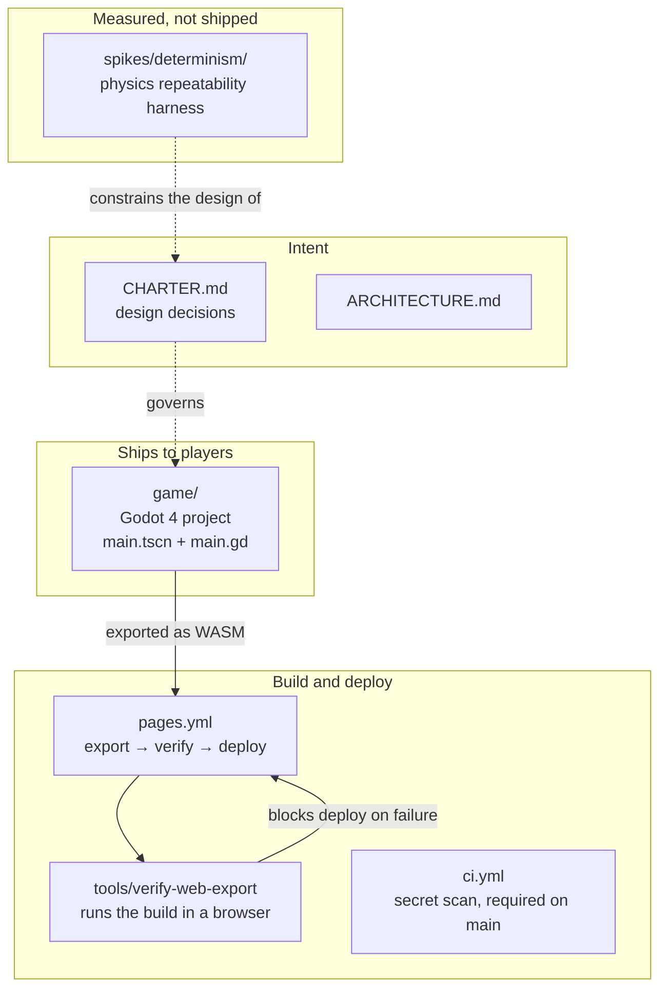
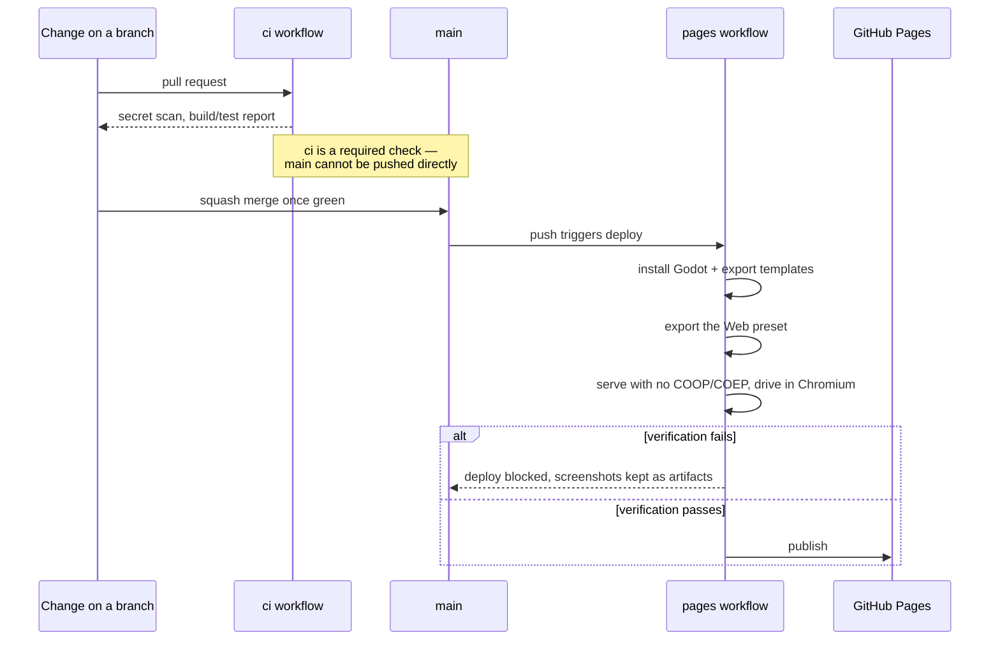
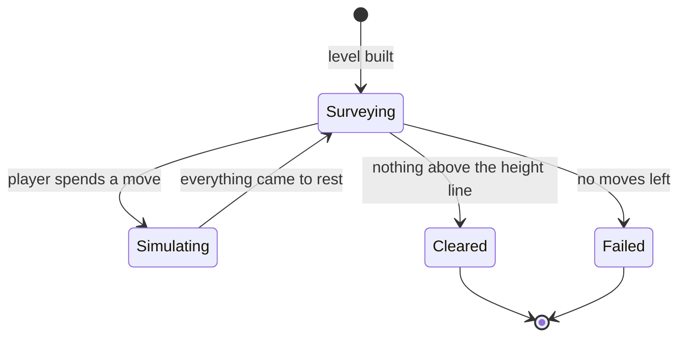

# Architecture

High-level map of CrumplZone: what the pieces are, how they fit, and which
of them ship. For what the game is meant to be, see `CHARTER.md`.

Very little of the game exists yet. This describes what is here, and is
updated in the same change that adds, removes or rewires a component.

## Components

**`game/`** is the only component that reaches players. It is a Godot 4
project targeting the GL Compatibility renderer, currently holding a single
scene: a hand-placed tower, a height line, and explosive charges on a move
budget. It exists to give the export pipeline something real to carry. The
tools, generated levels and scoring described in the charter are not built.

**`spikes/`** holds measurement harnesses that answer a question and then stay
as evidence. They are not imported by the game and are not exported. The one
here established that Godot's 2D physics repeats reliably enough for the
charter's generate-and-verify design.

**`tools/`** holds checks that are too slow or too browser-shaped to live in
the main test gate but must still be reproducible rather than done by hand.

## How a change reaches players

The verification step is the load-bearing part. A Godot web build with threads
enabled requires cross-origin isolation headers that GitHub Pages cannot send;
threads are therefore off in `game/export_presets.cfg`. That setting is easy to
flip back by accident, and the failure would appear in a player's browser
rather than in CI — so the pipeline serves the real artifact from a plain
static server, loads it in a real browser, and refuses to deploy unless it
renders and responds to input.

## The game's own structure

One scene, one script, so there is not much shape to describe yet — deliberately
so, until the charter's open questions are answered.

Play is turn-based: the simulation runs to rest between moves, so the player
always acts on a settled structure. `main.gd` builds the structure from
constants, applies a radial impulse where the player clicks, watches body
velocities to decide when the world has settled, and then counts how many
blocks remain above the height line.

## Things that are deliberately absent

- **No test framework.** There is no game logic stable enough to test yet, and
  the charter's testing default says to propose a setup rather than introduce
  one unilaterally. The two checks that do exist — the secret scan and the web
  export verification — run in CI.
- **No level format.** Levels are meant to be generated; hardcoding a schema
  before the generator exists would be guessing.
- **No separation between game and engine layers.** One script is not enough
  material to justify a boundary, and inventing one now would be a diagram
  drawn ahead of the code.
