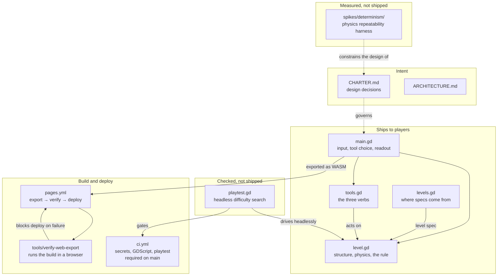
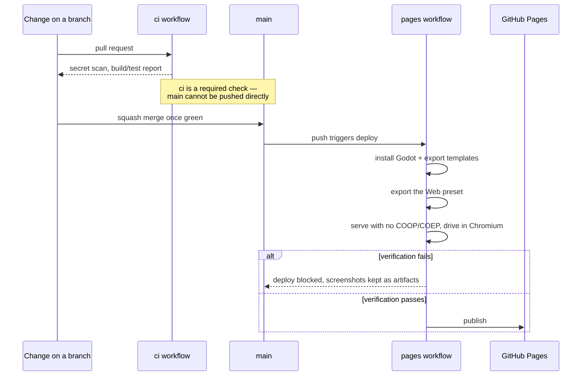
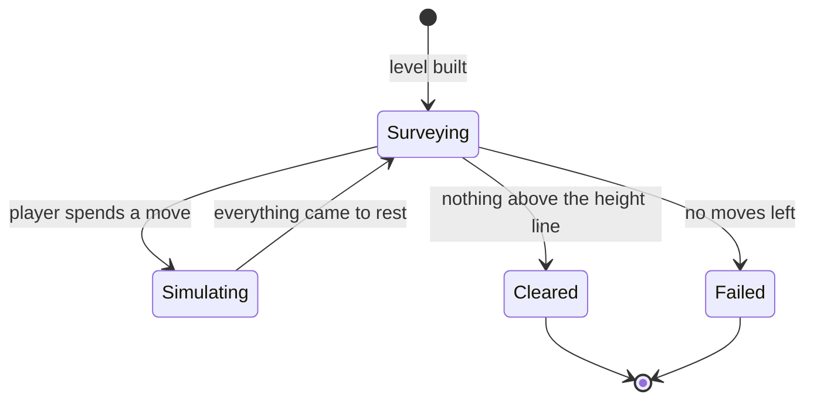

# Architecture

High-level map of CrumplZone: what the pieces are, how they fit, and which
of them ship. For what the game is meant to be, see `CHARTER.md`.

The game is early: one hand-built level, three tools, no generation and no
scoring. This describes what is here, and is updated in the same change that
adds, removes or rewires a component.

## Components

**`game/`** is the only component that reaches players. It is a Godot 4
project targeting the GL Compatibility renderer, split along one seam that
matters:

- **`level.gd`** owns a structure, the physics, and the height-line rule. It
  has no input handling, no UI and no scoring, because the charter's levels
  must be verified solvable before anyone plays them — which means a solver
  has to run this exact code thousands of times with nobody watching.
- **`tools.gd`** holds the three verbs. Each is a different way of acting on a
  structure rather than a damage number: the jackhammer removes the one block
  you point at, the wrecking ball shoves a horizontal band sideways, the
  explosive pushes radially and shatters what is very close. All cost one move.
- **`levels.gd`** produces level specs — plain dictionaries of blocks. Levels
  are hand-built today; the generator will emit the same shape, which is why
  this is a separate file from the thing that simulates it.
- **`main.gd`** is the player-facing wrapper: input, tool selection, the
  readout, and on-screen buttons for touch.

Scoring and generated levels are still absent.

**`spikes/`** holds measurement harnesses that answer a question and then stay
as evidence. They are not imported by the game and are not exported. The one
here established that Godot's 2D physics repeats reliably enough for the
charter's generate-and-verify design.

**`tools/`** holds checks that are too slow or too browser-shaped to live in
the main test gate but must still be reproducible rather than done by hand.

## How a change reaches players

The verification step is the load-bearing part. A Godot web build with threads
enabled requires cross-origin isolation headers that GitHub Pages cannot send;
threads are therefore off in `game/export_presets.cfg`. That setting is easy to
flip back by accident, and the failure would appear in a player's browser
rather than in CI — so the pipeline serves the real artifact from a plain
static server, loads it in a real browser, and refuses to deploy unless it
renders and responds to input.

## The game's own structure

Play is turn-based: the simulation runs to rest between moves, so the player
always acts on a settled structure. `level.gd` watches body velocities to
decide when the world has settled, then counts blocks whose *extent* — not
centre — still reaches above the line.

A tool that finds nothing to act on costs no move. Spending a move on a
misclick would punish imprecision, which the charter's second pillar says not
to do.

## Things that are deliberately absent

- **No unit test framework.** The charter's testing default says to propose a
  setup rather than impose one, and so far the checks that earn their keep are
  behavioural rather than unit-shaped: the secret scan, the web export
  verification, and `playtest.gd`, which searches the move space to confirm the
  level is solvable within its budget and not solvable in one move. All three
  run in CI. A unit framework becomes worth proposing when the generator
  arrives and there are pure functions worth pinning.
- **No scoring or progression.** Moves remaining is the obvious score and the
  charter has not settled what surrounds it — stars, chapters, endless — so
  nothing is built.
- **No undo.** Open in the charter, and it changes how punishing the budget
  feels, so it is a design decision rather than a missing feature.
- **No sound.** Central to the charter's first pillar and completely absent.
  A collapse without sound is half a collapse.
