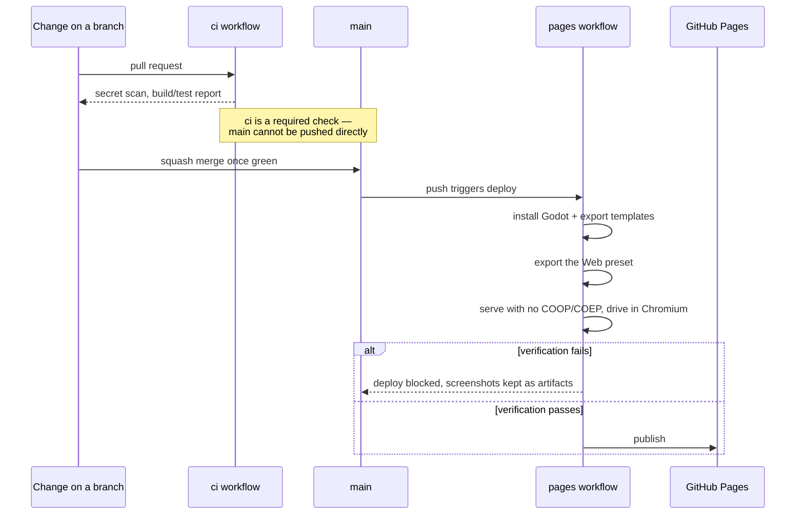
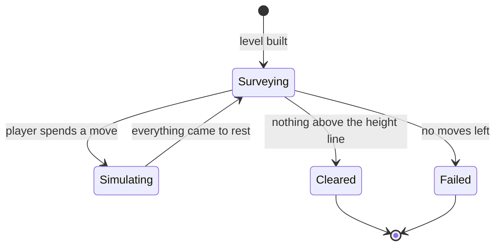

# Architecture

High-level map of CrumplZone: what the pieces are, how they fit, and which
of them ship. For what the game is meant to be, see `CHARTER.md`.

The game is early: one hand-built level, three tools, no generation and no
scoring. This describes what is here, and is updated in the same change that
adds, removes or rewires a component.

## Components

```mermaid
graph TD
    subgraph ships["Ships to players"]
        main["main.gd<br/>input, tool choice, readout"]
        ui["ui.gd<br/>CSS pixels → viewport units"]
        intro["intro.gd<br/>guide, version, release notes"]
        notes["release_notes.gd<br/>player-facing changes"]
        effects["effects.gd<br/>what the tool just did"]
        backdrop["backdrop.gd<br/>sky, skyline, street"]
        level["level.gd<br/>structure, physics, the rule"]
        materials["materials.gd<br/>durability and colour"]
        fracture["fracture.gd<br/>how a shape comes apart"]
        tools["tools.gd<br/>the three verbs"]
        levels["levels.gd<br/>hand-built specs"]
        generator["generator.gd<br/>seeded specs"]
        solver["solver.gd<br/>searches for a solution"]
    end

    subgraph checks["Checked, not shipped"]
        playtest["playtest.gd<br/>hand-built level difficulty"]
        waketest["waketest.gd<br/>settled bodies get woken"]
        breaktest["breaktest.gd<br/>everything breakable breaks"]
        collapsetest["collapsetest.gd<br/>broken columns stop carrying"]
        verifylv["verify_levels.gd<br/>generate-and-verify measurement"]
    end

    subgraph build["Build and deploy"]
        pages["pages.yml<br/>export → verify → deploy"]
        verify["tools/verify-web-export<br/>runs the build in a browser"]
        ci["ci.yml<br/>secrets, GDScript, playtest<br/>required on main"]
    end

    subgraph knowledge["Measured, not shipped"]
        spike["spikes/determinism/<br/>physics repeatability harness"]
    end

    subgraph docs["Intent"]
        charter["CHARTER.md<br/>design decisions"]
        arch["ARCHITECTURE.md"]
    end

    main --> intro
    notes --> intro
    ui --> main
    ui --> intro
    main --> effects
    main --> backdrop
    main --> level
    main --> tools
    materials -->|what a block is made of| level
    materials -->|swatches and hit counts| intro
    levels -->|level spec| level
    tools -->|acts on| level
    generator -->|level spec| solver
    solver -->|drives headlessly| level
    solver -->|budget = solution + slack| levels
    playtest -->|drives headlessly| level
    verifylv -->|drives| solver
    playtest -->|gates| ci
    waketest -->|drives| level
    waketest -->|gates| ci
    breaktest -->|drives| level
    breaktest -->|gates| ci
    collapsetest -->|drives| level
    collapsetest -->|gates| ci
    fracture -->|cuts a piece in two| level
    verifylv -->|gates| ci
    main -->|exported as WASM| pages
    pages --> verify
    verify -->|blocks deploy on failure| pages
    spike -.->|constrains the design of| charter
    charter -.->|governs| main
```

**`game/`** is the only component that reaches players. It is a Godot 4
project targeting the GL Compatibility renderer, split along one seam that
matters:

- **`level.gd`** owns a structure, the physics, and the height-line rule. It
  has no input handling, no UI and no scoring, because the charter's levels
  must be verified solvable before anyone plays them — which means a solver
  has to run this exact code thousands of times with nobody watching.
- **`materials.gd`** says what a block is made of and how much damage it
  absorbs before it comes apart, how many pieces it makes when it does, and what
  colour it is at each stage of wear. Durability runs 1 to 100 and one
  jackhammer blow is 12 of it, so the scale reads directly as blows: glass 1,
  brick 1, concrete 2, steel 3, reinforced concrete 9 — more than any budget.
  It is the reason a structure can be read before it is touched: glass is
  obviously the weak part and the core is obviously not worth your moves,
  without a legend.
- **`fracture.gd`** is pure geometry: it cuts a convex polygon with a straight
  line and keeps both halves convex, so a fragment can carry a real collider
  rather than an approximation of one. It has two patterns, because two
  materials break in genuinely different ways — brittle material comes apart in
  slivers radiating from the point struck, and structural material parts on one
  or two sloped faces. That slope is a physics decision, not a cosmetic one: a
  face only slides when its angle exceeds `atan(friction)`, so a shallow break
  locks together and a broken column carries its load as if it were whole.
  `collapsetest.gd` is what holds that honest.
- **`tools.gd`** holds the three verbs. Each is a different way of acting on a
  structure rather than a damage number: the jackhammer shatters the one piece
  you point at, the explosive pushes radially and damages by distance, and the
  wrecking ball is not a tool function at all — it asks `level.gd` for a real
  42 kg body on a pinned chain, released from the top of its arc, and the
  engine decides the rest. Its damage comes out of the momentum it is carrying
  when it lands rather than from a constant. All cost one move,
  and none of them delete anything — a block that vanished never read as
  physics. What they cost in damage meets what a material absorbs, which is
  where durability turns into a decision.
- **`levels.gd`** produces hand-built level specs — plain dictionaries of
  blocks. **`generator.gd`** produces the same shape from a seed, varying
  storeys, bays, spacing, pillar widths and which interior pillars are missing.
  Neither decides whether a level is any good.
- **`solver.gd`** does. It searches a level's move space by playing it: build,
  apply a candidate move, simulate to rest, score what is left, beam-search
  outward. A level is only playable once the solver has found a solution, and
  the move budget is that solution's length plus slack. It is tick-driven
  rather than a blocking loop, because physics only advances on physics frames
  and because generation will eventually need to run without freezing the game.
- **`main.gd`** is the player-facing wrapper: input, tool selection, the
  readout, and on-screen buttons for touch. It also frames the camera on the
  level, so the building fills whatever shape of screen it is given rather than
  sitting in a letterbox.
- **`ui.gd`** converts CSS pixels — the unit the mobile-first rules in
  `AGENTS.md` are written in — into the viewport units Godot lays out in. Every
  screen is built in CSS pixels and its layer scaled by that factor, which is
  what makes a 44 px touch target 44 px on a phone as well as on a laptop.
- **`effects.gd`** draws what a tool just did, and **`backdrop.gd`** draws the
  sky, the skyline and the street. Both are strictly cosmetic: they own no
  bodies and apply no forces, because the solver replays this game thousands of
  times headlessly and an animation that touched the simulation would make
  every one of those verdicts a lie about the game the player gets.
- **`intro.gd`** is the screen a player meets first — the goal, the three
  tools, the controls, the version and what changed in it. **`release_notes.gd`**
  holds the player-facing notes. The version itself lives in `project.godot` as
  `config/version`, and CI fails if it disagrees with the newest heading in
  `CHANGELOG.md`, so the game cannot tell a player one version while the
  repository says another.

Scoring and generated levels are still absent.

**`spikes/`** holds measurement harnesses that answer a question and then stay
as evidence. They are not imported by the game and are not exported. The one
here established that Godot's 2D physics repeats reliably enough for the
charter's generate-and-verify design.

**`tools/`** holds checks that are too slow or too browser-shaped to live in
the main test gate but must still be reproducible rather than done by hand.

## How a change reaches players

The verification step is the load-bearing part. A Godot web build with threads
enabled requires cross-origin isolation headers that GitHub Pages cannot send;
threads are therefore off in `game/export_presets.cfg`. That setting is easy to
flip back by accident, and the failure would appear in a player's browser
rather than in CI — so the pipeline serves the real artifact from a plain
static server, loads it in a real browser, and refuses to deploy unless it
renders and responds to input.

## The game's own structure

Play is paced by a power bar rather than by a count of moves: every use of a
tool takes a bite out of it, sized by how long the tool was held. Holding is
the whole interface — the jackhammer repeats while held, and the ball and the
charge build up and go on release — so the player decides how much to spend on
each use rather than every use costing the same.

The solver still works in whole, full-strength uses, which is the most
expensive way to play. That keeps its search discrete and, more usefully, means
a solution it finds is affordable however the player chooses to spend: tapping
or chipping buys *more* uses out of the same bar, never fewer. The wrecking ball is part of that: it is a
real body on a pinned chain rather than a force applied to an area, so a move
that swings it is not finished until the ball has swung, landed, been lifted
clear, and the building has stopped moving. `level.gd` reports the world
unsettled for as long as the ball is in play, which is what stops a move being
judged before its tool has arrived. `level.gd` watches body velocities to
decide when the world has settled, then counts pieces whose *outline* — not
centre — still reaches above the line.

Where that line sits is computed from the level's own material volume, by
`Levels.line_above_ground` — not chosen, and not a constant. Nothing is ever deleted, so a
demolished building has to fit underneath it as rubble: pulverise the hand-built
level completely and it settles into a pile 119 px deep, which is why the line
sits at 135 and not at the 100 it started at. A level whose line is below its
own rubble is unsolvable for reasons no amount of tactics can fix, and the
symptom — a beam search that plateaus at every depth — looks exactly like a
level that is merely hard.

A tool that finds nothing to act on costs no move. Spending a move on a
misclick would punish imprecision, which the charter's second pillar says not
to do.

## Things that are deliberately absent

- **No unit test framework.** The charter's testing default says to propose a
  setup rather than impose one, and so far the checks that earn their keep are
  behavioural rather than unit-shaped: the secret scan, the web export
  verification, `playtest.gd`, which searches the move space to confirm the
  level is solvable within its budget and not solvable in one move, and
  `waketest.gd`, which guards the sleeping-body fix. All of them run in CI. A unit framework becomes worth proposing when the generator
  arrives and there are pure functions worth pinning.
- **Generated levels are not wired into the game yet.** The generator and
  solver work and are measured, but verifying one level takes several seconds —
  far too long to run while a player waits. Putting generated levels in front
  of players needs the search to run in the background, which is a design step
  of its own rather than a line of glue.
- **No scoring or progression.** Moves remaining is the obvious score and the
  charter has not settled what surrounds it — stars, chapters, endless — so
  nothing is built.
- **No undo.** Open in the charter, and it changes how punishing the budget
  feels, so it is a design decision rather than a missing feature.
- **No sound.** Central to the charter's first pillar and completely absent.
  A collapse without sound is half a collapse.
